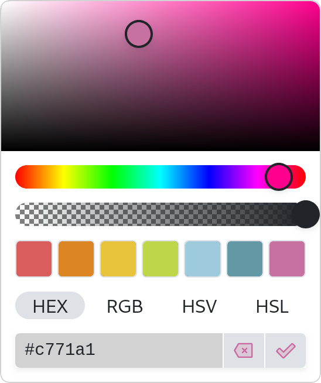
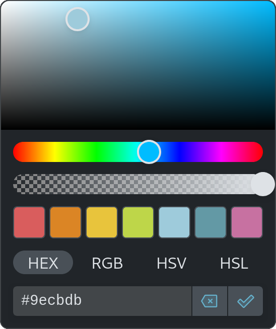

# JS ColorPicker

A color picker component supporting light and dark color schemes, swatches, instant and submit modes, multiple color formats, CSS color parsing and way more.

## Table of Contents

- [JS ColorPicker](#js-colorpicker)
  - [Table of Contents](#table-of-contents)
  - [Features](#features)
  - [Live Demo](#live-demo)
  - [Screenshots](#screenshots)
  - [Installation](#installation)
    - [IIFE Bundle](#iife-bundle)
    - [ESM Bundle](#esm-bundle)
  - [Getting Started](#getting-started)
    - [Creation](#creation)
    - [Opening](#opening)
    - [Setting Color](#setting-color)
    - [Binding Events](#binding-events)
    - [Dialog Only](#dialog-only)
  - [Documentation](#documentation)
  - [Customization](#customization)
    - [Color Scheme](#color-scheme)
    - [Toggle Size](#toggle-size)
    - [CSS Variables](#css-variables)
  - [Developing](#developing)

## Features

- 🌙 Dark and light themes
- 🪞 Preview
- 🌈 Swatches
- 🫥 Alpha slider
- 💧 EyeDropper
- 📜 CSS color parsing (including names!)
- 🔼 Button, input and hidden styles
- 🔢 Multiple color formats
- ⏱️ Customizable animation speed
- ✅ Apply color immediately, or on submit
- 🚫 Clearable
- ⌨️ Keyboard support

## Live Demo

TODO

## Screenshots

|            |                         Light                          |                         Dark                          |
| :--------- | :----------------------------------------------------: | :---------------------------------------------------: |
| **Button** |   |   |
| **Input**  |   |   |
| **Dialog** |  |  |

## Installation

The color picker requires a tiny stylesheet. Please include it like this:

```html
<link rel="stylesheet" href="colorpicker.css" />
```

Now, depending on your environment, choose one of the following:

- IIFE Bundle → When using vanilla JavaScript, without ES modules
- ESM Bundle → When using ES modules or a bundler

### IIFE Bundle

Please import the IIFE script using a `script` tag in your HTML:

```html
<script src="colorpicker.iife.js"></script>
```

This exposes the `ColorPicker` class (on window).

### ESM Bundle

Please import the ESM bundle using the `import` directive in your script:

```js
import ColorPicker from 'colorpicker.js'
```

This allows you to use `ColorPicker` directly.

## Getting Started

### Creation

To create a color picker, first create a button:

```html
<button id="picker"></button>
```

Next instantiate the ColorPicker, passing an element to bind to and an (optional) configuration:

```js
const picker = new ColorPicker('#picker', {
  commitMode: 'instant',
  showSubmitButton: 'false',
})
```

### Opening

If you want to open or close the dialog, use their respective methods:

```js
picker.open()
picker.close()
picker.toggle()
picker.destroy()
```

You can also open it as a prompt, returning a promise once the picker is closed:

```js
const color = await picker.prompt()
```

### Setting Color

If you want to set or clear the color, you can use the `.setColor()` and `.clear()` methods:

```js
picker.setColor('#ff00ff')
picker.clear()
```

### Binding Events

If you want to listen to certain events, like opening or picking, use the `.on()` method:

```js
picker.on('open', () => console.log('open'))
picker.on('opened', () => console.log('opened'))
picker.on('close', () => console.log('close'))
picker.on('closed', () => console.log('closed'))
picker.on('pick', (color) => console.log('pick', color))
picker.on('cancel', () => console.log('cancel'))
```

### Dialog Only

If you want to open a picker dialog without a toggle, (optionally) destroying it after, you can use the `toggleStyle` option with the `prompt()` method:

```js
const picker = new ColorPicker(target, {
  toggleStyle: 'hidden',
})

const color = await picker.prompt(true)
```

## Documentation

For all methods and properties, please view the [documentation](DOCUMENTATION.md).

## Customization

### Color Scheme

You can change the color scheme by using one of the following dataset properties:

```html
<html data-cp-theme="dark"></html>
<html data-bs-theme="dark"></html>
<html data-cp-theme="light"></html>
<html data-bs-theme="light"></html>
```

### Toggle Size

The size of the toggle button can be changed by altering the `height` property:

```css
.color-picker {
  height: 2rem;
}
```

### CSS Variables

You can alter a variety of styles using their respective CSS variables:

```css
:root {
  /* Animations (set to 0s to disable) */
  --cp-delay: 150ms;

  /* Metrics */
  --cp-border-radius-sm: 0.25rem;
  --cp-border-radius-lg: 0.5rem;
  --cp-swatch-width: 2rem;

  /* Colors */
  --cp-body-bg: #fff;
  --cp-body-color: #212529;
  --cp-body-color-rgb: 33, 37, 41;
  --cp-border-color: #dee2e6;
  --cp-border-color-translucent: rgba(0, 0, 0, 0.175);
  --cp-tertiary-color: rgba(33, 37, 41, 0.5);

  /* Shadows */
  --cp-box-shadow: 0 0.5rem 1rem rgba(0, 0, 0, 0.15);
  --cp-box-shadow-sm: 0 0.125rem 0.25rem rgba(0, 0, 0, 0.075);
}
```

## Developing

To install dependencies:

```sh
bun|deno|npm|pnpm|yarn install
```

To run:

```sh
bun|deno|npm|pnpm|yarn run dev
```
